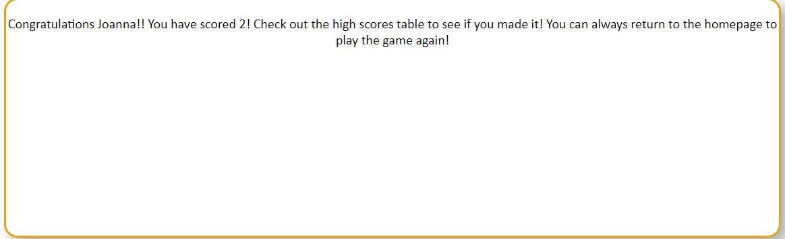
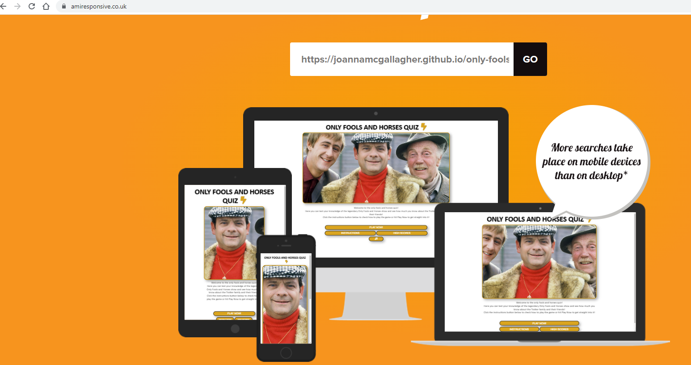
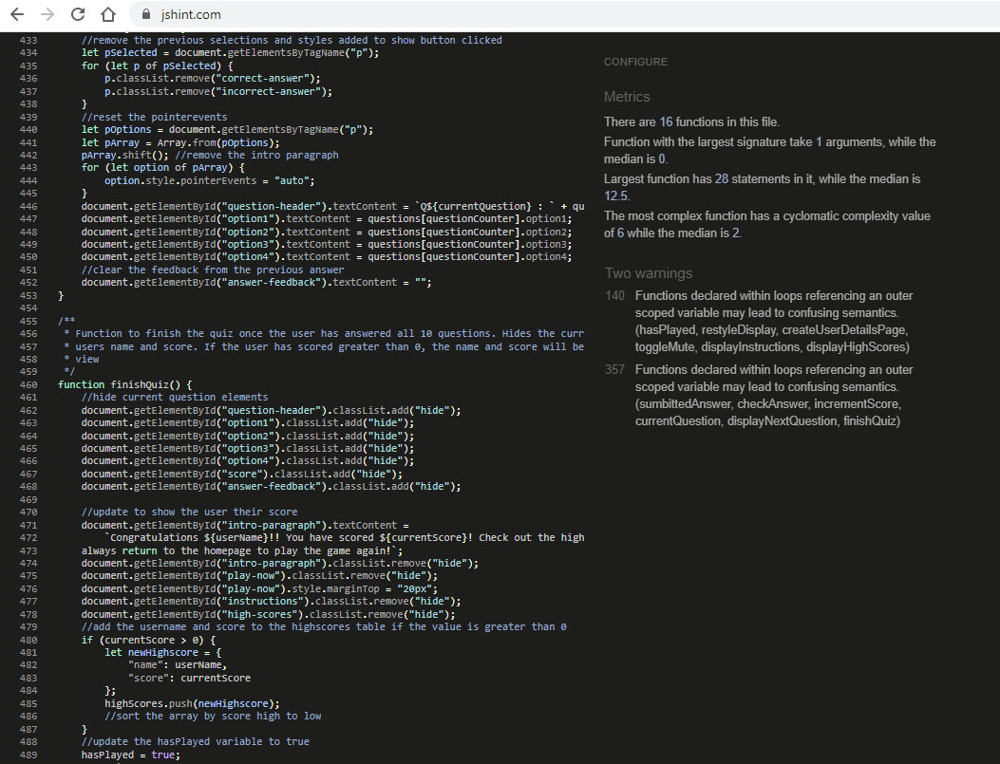
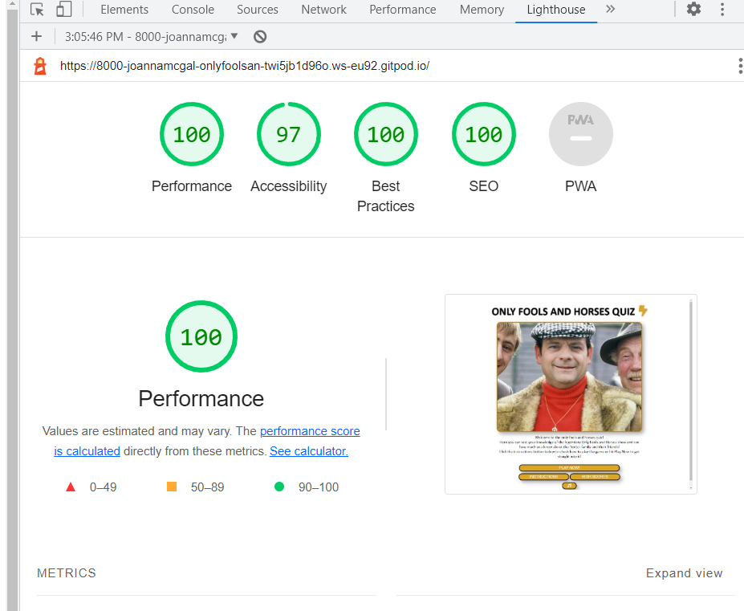

# Only Fools And Horses Quiz

This is an online quiz created to test users knowledge of the TV show Only Fools and Horses. The quiz will ask the user to input their name and will then display 10 multiple choice questions, each with a choice of 4 possible answers. When the user has completed the quiz, it will add their name and score to the high scores table providing they scored above 0.

## User Story

* I have shown a great interest in the Only Fools and Horses TV since my childhood and it still continues to be aired on a daily basis. I would like to challenge my knowledge through an online quiz to put my brain to the test. 

## Design

* Strategy

    I want to design a website that enables the user to take part in an online quiz based on the show Only Fools and Horses. I want each question in this quiz to have four possible answers and to display feedback depending on whether the user has answered corretly or incorrectly.

* Scope 

    I plan on having the index.html page as the main page and manipulating the elements as the quiz goes on and using a class in the style.css file to display or show the elements depending on what the page requires.

* Structure

    + There will be a h1 element on the top of the page which will display throughout the quiz and it will be a link back to the start.
    + There will be an image on the page when it loads showing the main characters of the show. This is contained in a div and the image will be updated to a smaller image when the quiz is taking place. A welcome message displayed beneath in a p element. This p element will also be used to display the instructions and a message showing the user their score when they have finished the quiz.
    + There will be buttons to navigate through the site and quiz which will be contained in a div which can be hidden or shown depending on where in the quiz the user is. There will be event listeners added to these buttons when the DOM is loaded.
    + A form will be used to retrieve the users name with an event listener added so the name can be stored in a global variable. This is contained in a div.
    + The question area will be made up of a h3 and four p elements. To provide feedback to the user, there will be a p element, span element to display the current score and another p element to give the feedback along with the correct answer should the user click on the incorrect one.
    + The high scores will be shown in a table, contained in a div. There will be high scores loaded in from the script.js file and once the user has completed the quiz and answered one or more questions correctly, the users name and score will be added in to the table.
    + There are two audio elements in teh index.html. One is for the theme tune to the show and the second one is to add to the feedback provided and will play a short audio clip based on the users answer and if they answered correctly or now.

* Skeleton

    I planned this site using Balsamiq so I could easily lay out the site.

    
    
    
    

* Surface

    The finished site will have the same theme and colours throught with the colours being similar to those shown on the TV show. The logo and and headers will be in black but the buttons and p elements for the multiple choices will be in darkgoldenrod with white text. When the usesr hovers over these, the colours will invert.

    

    When a user selects an answer, the colour of the element will change to either dark red or dark green depending on if the user has selected the correct one.

    
    

    The font I used for this site is Calibri with a back-up os Sans Serif.    

## Features

* Logo
    * This is created with a h1 and a font awesome icon and features throughout the quiz. It is also a link to direct the uer back to the start.

* Buttons
    * There are buttons for the user to navigate through the site and to start the quiz. These all follow the same style and take on the show/hide classes when they need to be displayed/hidden. There are also classes applied for when the user hovers over which will invert the colors keeping in with the style and color combination for the site. I have also included a mute button so the user can toggle the audio on the site. These buttons have a border radius and a box shadow style being applied in the stylesheet. 

* Images
    * When the site is loaded, the main image shows the Trotter family which are the prominent characters in the show. 
    
    

    * When the user clicks on the button to play now, the image updates and is scaled down to allow for more room for the form and questions.

    

* Form
    * There is a form to allow the user to enter in their username so they can be entered into the high scores table providing they score above 0. The username is required for the input field so the user cannot start the quiz without entering a name in.

    

* Question and answers page
    * When the suer gets this far, they are presented with the question which is a h3 and four p elements for the user to select their answer. These have the same styles applied as that of the buttons and when the DOM detects a click event, another style is added and element will be green for a correct answer or red for an incorrect answer. They also have a border radius and box shadown and the box shadow updates the color based on the answer selected. The current score will also update if the user has selected the correct answer and if not, the correct answer will be displayed.

* Feedback when the quiz has finished
    * When the user has answered all the questions, they will be shown the below message which has their name and their final score. 

* High scores table
    * There is a table which will be displayed when the user clicks on the high scores button. If they have played the quiz and have scored above 0, they will be entered into the table also. These scores are stored in an objects array.

### Technologes used
    * HTML
    * CSS
    * Javascript
    * Balsamiq
    * Github
    * Gitpod

### Testing
    * I have tested this site on multiple browsers such as Chrome, Edge and Firefox and appears to be working fine on all. I have also tested it on multiple devices such as a large screen desktop, an iphone and my own mobile which is a Samsung S22 Ultra and it appears to be responsive. 
    * When I deployed the site on Github and tested it, the audio and favicon files do not load in. The folder is missing from the assets folder and I have tried to remedy this but to no avail. However, in the repository, the audio works correctly.

    * By using the colors detailed above, the site is quite readable and there is high contrast between the foreground and background. The images and colours flow well together and keep in tone with that of the TV show.
    * For testing purposes, I reduced the number of questions displayed to two to prevent having to go through all questions to test various elements.

### Features left to implement
    * I would like to have three levels of questions in the future; beginner, intermediate and advanced.   

### Responsive
    * I have run the deployed site on Am I Responsive https://amiresponsive.co.uk/ wchich displays the site on a variety of devices.

### Bugs
    * I encountered an issue with ensuring a user entered a name in the form section. I researched and sought the help of tutor support and was able to resolve it then. Initially, I had not got then input field declared in a form and this was part of the bug.
    * I encountered issues with the repository not loading in the latest code. I spoke to tutor support and they were able to advise both times.
    * When trying to read in the data from the high scores array and display it in the table, I had to research this many times as it would not read the data. Eventually, after playing around with this, I was able to get this working.
    * The audio files caused a bug more specifically when I was trying to mute them when the user clicked on the button. Again, I was able to resolve this by researching on the web.
    * There was a bug when trying to display the correct answer when the user clicked on an incorrect answer. It was to do with the referencing of that item in the array of objects. Again, playing around with this and trying different methods and I was able to resolve this.

### Unfixed bugs
    * The audio files causing a 404 error when the site is deployed. When I open the site in the browser from the repo, it works as it should but when I use the Google Dev tools on the live site, the audio folder does not carry over therefore, the files are unable to play.
    * When the user has played through the quiz and goes to play again, the current score remains at their last score despite me resetting this to 0 in the finish quiz function. I have worked on this and tried various methods but to no avail. 
    * On smaller devices, the applied styles for incorrect answer and correct answer do not apply. On larger size sreens, this works fine. I researched this but ultimately ran out of time to resolve this. 

## Validator Testing

* HTML
    I ran the HTML code through the HTML validator https://validator.w3.org/#validate_by_uri and initially there were a couple of warnings but I resolved these and re-ran the code with no warnings or errors.
    
     

* CSS
    I ran the CSS code through the validator at https://jigsaw.w3.org/css-validator/validator and there were some issues which I worked through and resolved and it was run through again with no errors or warnings.

    

* Javascript
    I ran the Javascript code through the jshint site at https://jshint.com/ and there were multiple warnings including some missing semicolons and two variables that were deckared but never used. I went through these and when I ran the code again, it ran with no errors or warnings.

    

* Lighthouse
    I ran a report on this in Lighthouse which is part of the Google Dev tools.

    

## Deployment
    * The site is deployed to Github pages following the below steps:
        * In Github for the selected repository, click on settings.
        * Click on the Pages option
        * In the sources selection menu, click on main branch in the dropdown.
        * Click Save
    
    * The repository link can be found [here](https://github.com/Joannamcgallagher/only-fools-and-horses)
    * The live link can be found here - 

## Content
    * Favicon image : https://nationalmotormuseum.org.uk/wp-content/uploads/2017/11/Reliant-Van-Trotters-1972.jpg
    * Main image, Trotter family : https://www.dailyrecord.co.uk/entertainment/celebrity/only-fools-horses-episode-banned-27545705
    * Secondary image : https://fanart.tv/series/75628/only-fools-and-horses/
    * Icons were park of the font awesome kit
    * Audio files : Recorded from the show

## Credits
    * Love Maths walkthrough project 
    * https://www.w3schools.com/tags/att_audio_controls.asp for help with creating table elements in the index.html
    * https://developer.mozilla.org/en-US/docs/Web/Accessibility/ARIA/Attributes/aria-label for adding an aria-label to make the button for mute accessible for those with screen readers
    * https://www.w3schools.com/css/css_table_style.asp for help styling the rows in the table so that every even row were styled with a differenct background color
    * https://www.w3schools.com/jsref/prop_style_cursor.asp for changing the style of the cursor so it becomes a pointer on hover over the options for the questions
    * https://www.tutorialspoint.com/How-to-add-rows-to-a-table-using-JavaScript-DOMz for adding data to the table from the DOM on a click event
    * https://www.geeksforgeeks.org/how-to-pre-select-an-input-element-when-the-page-loads-in-html5/ to enable the focus in teh input field when the form loads